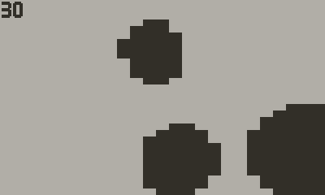
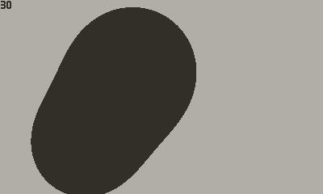

# Playdate C Metaballs

A C implementation of simple (no marching squares) [metaballs](https://en.wikipedia.org/wiki/Metaballs) for the Playdate. See the Lua version in the [Playdate Coracle project](https://github.com/orllewin/playdate_coracle/blob/main/drawings/metaballs.md).

**Note. I'm not a C developer and this is the first non-trivial C I've attempted**

## Optimised version
30fps here in the simulator recording, but a still healthy 20fps on hardware. An offscreen buffer of 50x30 pixels is used to firstly calculate the vector based particles animation, then the metaball pixel array iteration, the metaball calculations skip every other x pixel, essentially halving the horizontal resolution further. The buffer is then scaled to full screen size. A small additional performance improvement is achieved by using `pd->display->setScale(2);` to half the screen resolution for when the offscreen buffer is scaled into screen (1 to 2fps improvement). 
 

## Initial Unoptmised version
This was the first attempt, iterating all 400x240 pixels with no performance considerations at all. Runs beautifully in the simulator, but of course only manages 1 or 2fps on hardware.

